# Tynoc E-Commerce

Boutique en ligne de matériel audio haut de gamme (casques, écouteurs, enceintes, convertisseurs,
amplificateurs, microphones) construite avec Next.js 16, TypeScript et AWS DynamoDB.

Le projet répond à un énoncé de stage qui demandait une application **de niveau production** :
l'interface compte, mais l'évaluation porte d'abord sur l'architecture, la logique métier, l'API,
la conception de la base et la gestion des erreurs. Ce README en suit les huit sections imposées.


| | |
| --- | --- |
| Dépôt | <https://github.com/nagoloumdaniel/Tynoc-ecom> |
| En ligne | À venir (phase P14 de la roadmap) |
| Périmètre | Vitrine, panier, liste de souhaits, données utilisateur. **Pas de paiement** : hors énoncé |

## Sommaire

1. [Présentation](#1-présentation)
2. [Fonctionnalités](#2-fonctionnalités)
3. [Stack technique](#3-stack-technique)
4. [Structure du projet](#4-structure-du-projet)
5. [Architecture](#5-architecture)
6. [Configuration DynamoDB](#6-configuration-dynamodb)
7. [Variables d'environnement](#7-variables-denvironnement)
8. [Installation](#8-installation)
9. [Tests et qualité](#9-tests-et-qualité)
10. [Documentation détaillée](#10-documentation-détaillée)

## 1. Présentation

Tynoc est un magasin fictif dont chaque fiche porte les caractéristiques qui décident réellement
d'un achat audio : impédance, réponse en fréquence, distorsion. Le catalogue de démonstration
compte **47 produits répartis en 8 familles**.

Un visiteur peut parcourir le catalogue, chercher et filtrer, remplir un panier et une liste de
souhaits qui survivent à la fermeture du navigateur, puis consulter, modifier ou effacer les
données que le site détient sur lui. Il n'y a ni compte ni mot de passe : l'énoncé demande la
« gestion des données utilisateur », pas une authentification. Chaque visiteur reçoit une
identité anonyme, portée par un cookie signé.

Le parcours s'arrête au panier, et le site le dit plutôt que d'afficher un bouton « Commander » qui
ne mènerait nulle part.

## 2. Fonctionnalités

Chaque fonctionnalité ci-dessous est reliée à son code et à son test dans
[docs/CONFORMITE.md](docs/CONFORMITE.md).

### Vitrine

- **Accueil, catégories, listing et fiches produit**, avec galerie d'images et tableau de
  caractéristiques.
- **Recherche et filtres** (catégorie, prix, disponibilité, tri) dont **tout l'état vit dans
  l'URL** : un résultat se partage, se recharge, et le bouton retour du navigateur fait ce qu'on en
  attend.
- **Pagination** par curseur opaque.
- **Produits associés** de la même famille sur chaque fiche.

| Catégorie | Fiche produit |
| --- | --- |
|  | 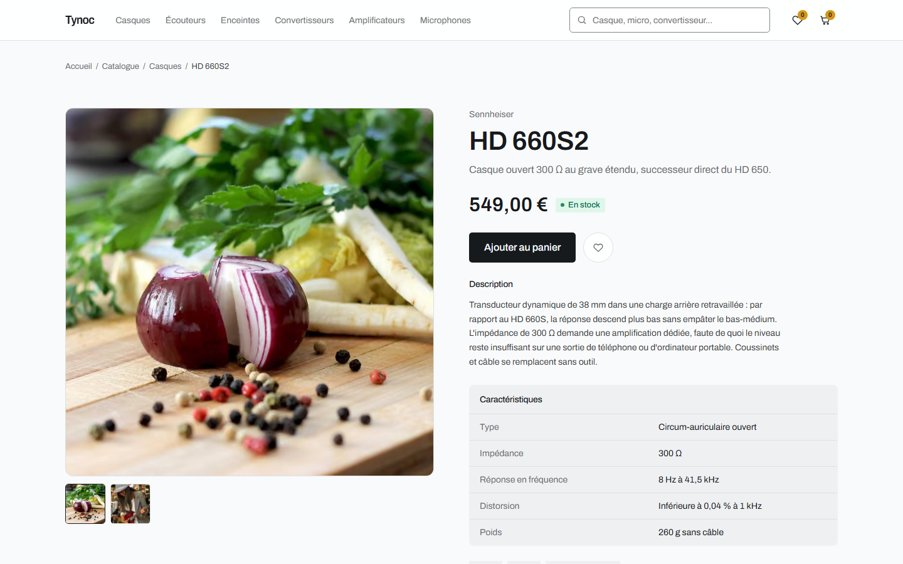 |

| Filtres | Recherche |
| --- | --- |
|  | 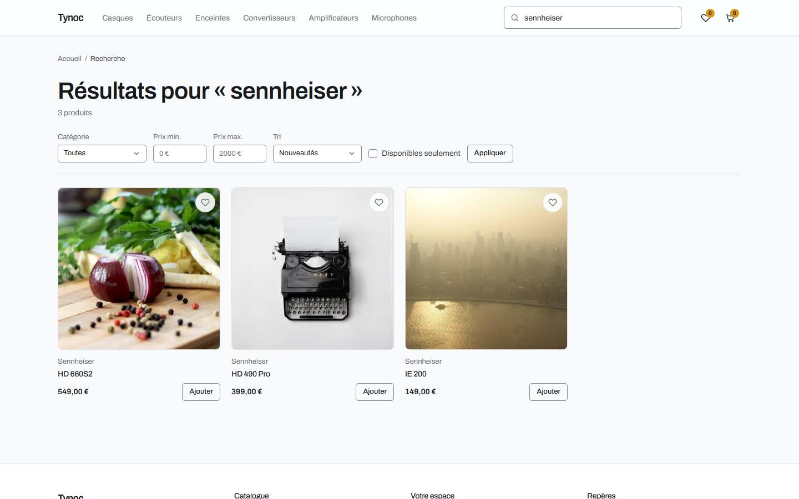 |

### Panier et liste de souhaits

- **Ajouter, modifier la quantité, retirer** : un retrait s'annule depuis la notification.
- **Sous-total calculé côté serveur**, en centimes entiers, à partir du prix courant du produit.
  Une ligne de panier ne stocke jamais de prix : un changement de tarif s'applique partout.
- **Quantité bornée par le stock réel** et par un plafond par article, avec un message quand la
  demande est ajustée.
- **Aucun doublon** : ajouter deux fois le même produit incrémente sa ligne. La garantie vient de
  la clé de stockage elle-même, pas d'une vérification applicative.
- **Liste de souhaits** avec déplacement vers le panier ; un produit en rupture reste mettable de
  côté.

| Panier | Liste de souhaits |
| --- | --- |
| 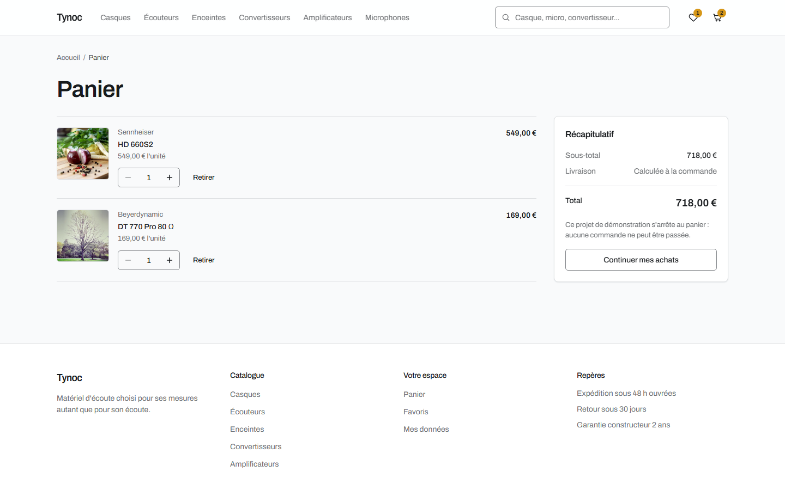 | 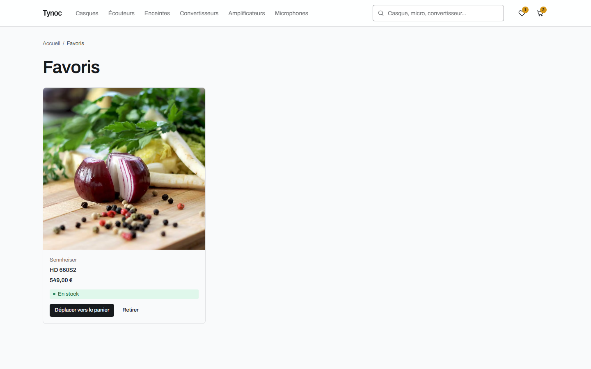 |

### Données utilisateur

- **Profil éditable**, avec validation par champ.
- **Vue de transparence** : ce que le site détient réellement sur le visiteur.
- **Effacement complet** de ses données, en une opération.

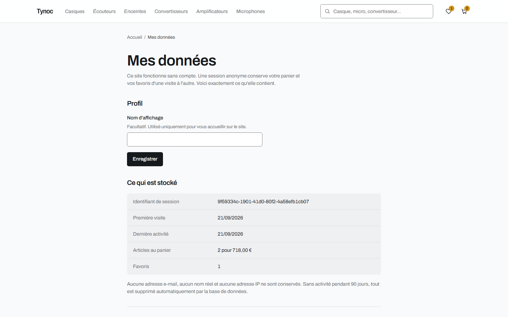

### Expérience applicative

- **Responsive** de 360 à 1440 pixels, vérifié automatiquement à quatre largeurs.
- **États de chargement** fidèles au gabarit du contenu, pour que rien ne saute à l'arrivée des
  données.
- **États vides** qui proposent toujours une sortie.
- **Erreurs** : message clair, bouton pour réessayer, référence d'incident. Aucun message interne
  ne sort du serveur.
- **Page 404** utile, avec recherche et raccourcis, plutôt qu'un simple code.
- **Accessibilité** : navigation au clavier, contrastes WCAG mesurés, cibles tactiles de 44 px.

| Panier vide | Aucun résultat | Page introuvable |
| --- | --- | --- |
| 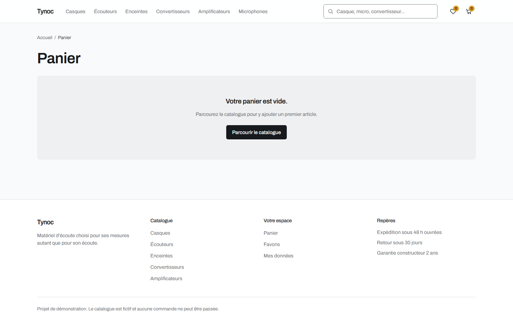 | 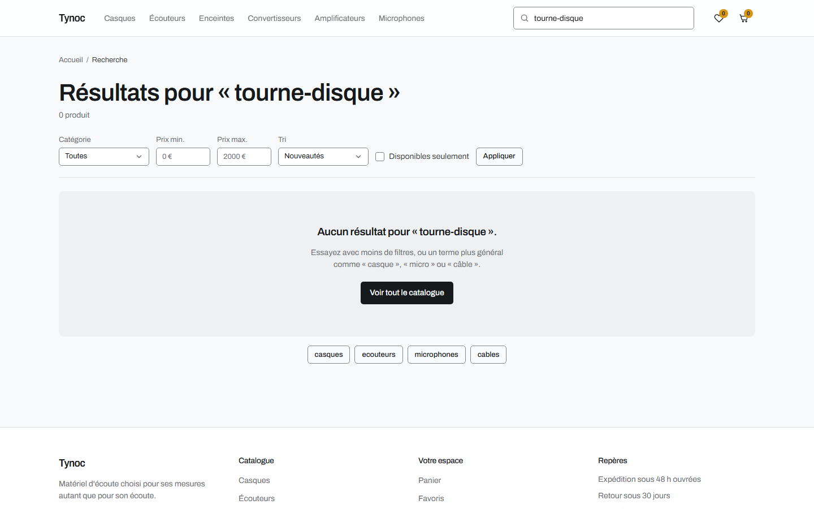 | 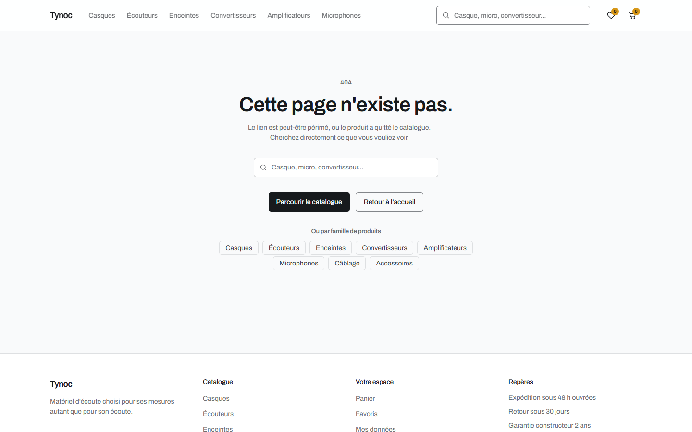 |

| Mobile : accueil | Mobile : menu | Mobile : fiche | Mobile : panier |
| --- | --- | --- | --- |
| 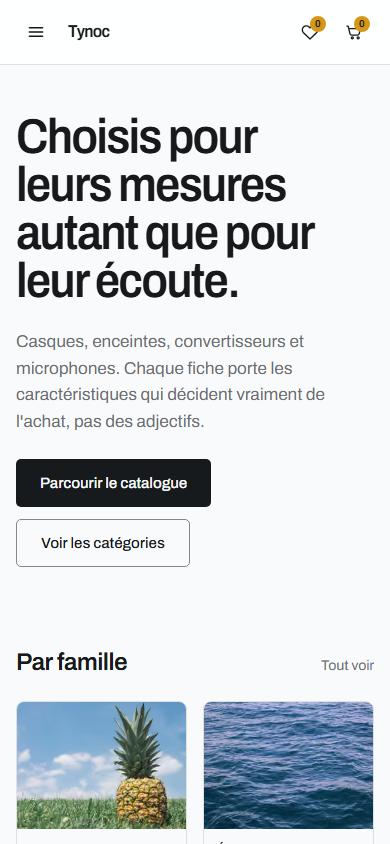 | 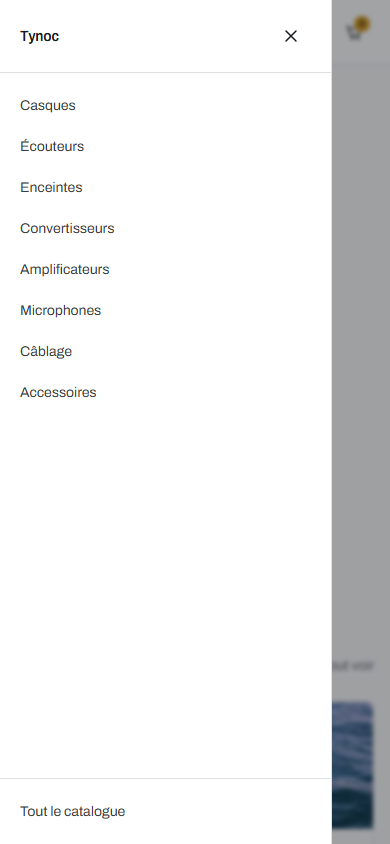 | 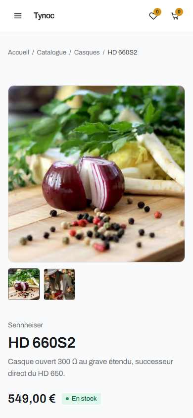 | 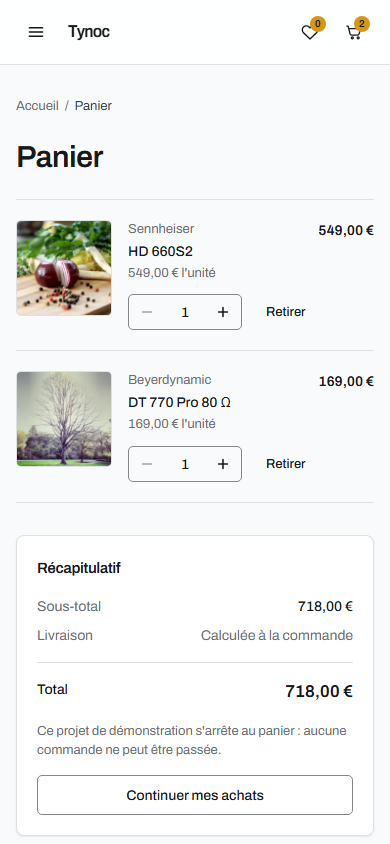 |

## 3. Stack technique

| Couche | Choix | Pourquoi |
| --- | --- | --- |
| Framework | **Next.js 16.3**, App Router, Turbopack | Imposé. Server Components, Server Actions et Cache Components |
| Interface | **React 19.2** | `useOptimistic` pour les réactions immédiates, sans dupliquer l'état serveur |
| Langage | **TypeScript 5**, strict renforcé | `noUncheckedIndexedAccess` et `verbatimModuleSyntax` : les accès incertains sont typés comme tels |
| Styles | **Tailwind CSS v4** | Imposé. Jetons de couleur en OKLCH, thème clair et sombre sans classes `dark:` |
| Base | **AWS DynamoDB**, table unique | Imposé. Un modèle conçu à partir des accès, pas des entités |
| Validation | **Zod 4** | Une seule source de vérité : les types sont dérivés des schémas |
| Tests | **Vitest**, **Testing Library**, **Playwright** | Logique pure, composants, puis vrai navigateur contre le build de production |

**Rendu.** Toutes les pages servent une coquille prérendue, et seul ce qui dépend du visiteur
(panier, compteurs, favoris) arrive ensuite en flux. Les lectures du catalogue sont mises en cache
avec le profil `hours` de Next.

## 4. Structure du projet

```text
src/
├── app/                   Routes, mises en page, pages d'état, routes API
│   ├── api/               Routes HTTP : panier, favoris, produits, catégories
│   ├── products/          Listing et fiche produit
│   ├── categories/        Liste et page de catégorie
│   ├── cart/  wishlist/   Panier et liste de souhaits
│   ├── account/           Données de l'utilisateur
│   ├── error.tsx          Frontière d'erreur des pages
│   └── not-found.tsx      Page 404
├── components/
│   ├── ui/                Primitives sans métier : bouton, champ, badge, boîte de dialogue
│   ├── product/  cart/    Composants métier
│   ├── wishlist/ account/
│   ├── layout/            En-tête, pied de page, navigation mobile
│   ├── feedback/          États vides, d'erreur et de chargement
│   └── seo/               Données structurées JSON-LD
├── server/
│   ├── actions/           Server Actions : entrées des écritures depuis l'interface
│   ├── services/          Logique métier, pure et testable sans base
│   ├── repositories/      Accès DynamoDB, et rien d'autre
│   └── catalogue.ts       Lectures du catalogue mises en cache
├── schemas/               Schémas Zod, source des types du domaine
├── lib/                   Client DynamoDB, environnement, erreurs, clés, session
└── proxy.ts               Attribution de la session, contrôle d'origine des écritures d'API

scripts/                   Création de la table, catalogue et seed
tests/
├── unit/                  Services et fonctions pures
├── components/            Composants, sous Testing Library
├── integration/           Repositories et routes contre DynamoDB Local
└── e2e/                   Parcours dans un vrai navigateur
infra/                     Politiques IAM au moindre privilège
docs/                      Architecture, modèle de données, API, conformité, roadmap
```

`src/types/` est vide, volontairement : les types du domaine sont dérivés des schémas Zod
(`z.infer`), jamais écrits une seconde fois à la main.

## 5. Architecture

```text
Utilisateur → Application Next.js → Couche serveur / API → AWS DynamoDB
```

Le code est découpé en couches **à sens unique** :

```text
app/ → server/actions/ + app/api/ → server/services/ → server/repositories/ → lib/dynamodb
```

| Couche | Connaît | Ne connaît jamais |
| --- | --- | --- |
| Composants serveur | Types du domaine, services en lecture, Server Actions | `PK`/`SK`, le SDK AWS, un repository |
| Composants client | Types du domaine, Server Actions | Tout le reste de `server/` |
| Actions et routes API | HTTP, cookies, services | DynamoDB, `PK`/`SK` |
| Services | Types du domaine, contrats de repositories, erreurs | React, HTTP, `PK`/`SK` |
| Repositories | Le SDK, les clés, les mappers | Les règles métier |

**Cette règle n'est pas une convention.** ESLint la vérifie à chaque commit, avec un bloc par couche
qui échoue sur un import interdit, et `import "server-only"` fait échouer le build si un composant
client importe un service.

Trois choix qui en découlent :

- **Les services reçoivent leurs repositories en paramètre.** Ils se testent avec de faux
  repositories en mémoire, sans base ni conteneur ; le câblage réel vit dans
  `server/services/index.ts`.
- **Toute erreur devient une `AppError`** qui porte son code, son statut HTTP et la décision de
  pouvoir montrer ou non son message. Une erreur de base de données ne sort jamais telle quelle.
- **L'identité vient toujours du cookie serveur**, jamais d'un paramètre client. Aucune signature de
  service n'accepte un identifiant d'utilisateur venu du navigateur.

Le détail, avec les parcours et la matrice des états d'écran : [docs/ARCHITECTURE.md](docs/ARCHITECTURE.md).

## 6. Configuration DynamoDB

### Le modèle

Une **table unique**, en facturation à la demande, avec deux index secondaires globaux :

| Élément | Clé de partition | Clé de tri | Sert à |
| --- | --- | --- | --- |
| Table | `PK` | `SK` | Produits, catégories, et tout ce qui appartient à un utilisateur |
| GSI1 | `GSI1PK` | `GSI1SK` | Lister le catalogue ou une catégorie, trié par prix |
| GSI2 | `GSI2PK` | `GSI2SK` | Retrouver un produit depuis son slug d'URL |

| Entité | `PK` | `SK` |
| --- | --- | --- |
| Produit | `PRODUCT#<id>` | `META` |
| Catégorie | `CATEGORY#ALL` | `CATEGORY#<slug>` |
| Profil utilisateur | `USER#<id>` | `PROFILE` |
| Ligne de panier | `USER#<id>` | `CART#<productId>` |
| Entrée de wishlist | `USER#<id>` | `WISH#<productId>` |

Profil, panier et favoris d'un même visiteur partagent une partition : les lire est une seule
`Query`, et l'effacement de ses données en est une aussi. **Aucune opération `Scan`** n'est
utilisée, nulle part ; les onze patterns d'accès sont rejoués contre une vraie base par
`tests/integration/data-model.test.ts`.

Les données d'un visiteur expirent 90 jours après sa dernière écriture, par le TTL natif de
DynamoDB (attribut `expiresAt`), sans tâche planifiée.

La lecture, la création, la mise à jour et la suppression de chaque entité sont décrites dans
[docs/DATA-MODEL.md](docs/DATA-MODEL.md), avec les décisions qui structurent le modèle.

### En local : DynamoDB Local

Le développement ne demande **aucun compte AWS**. DynamoDB Local tourne dans Docker
(`docker-compose.yml`) et accepte n'importe quelle signature.

```bash
npm run db:up             # démarre le conteneur sur le port 8000
npm run db:create-table   # table, deux index et TTL (idempotent)
npm run db:seed           # 8 catégories, 47 produits (idempotent)
```

### Sur AWS

1. Créer un utilisateur IAM pour l'application avec la politique
   [infra/iam-runtime-policy.json](infra/iam-runtime-policy.json) : lecture et écriture des items
   de la table, requêtes sur ses index, **rien d'autre**. Des clés qui fuiraient ne permettraient
   ni de supprimer la table, ni d'accéder au reste du compte.
2. Créer la table une fois, avec une identité portant
   [infra/iam-provisioning-policy.json](infra/iam-provisioning-policy.json), en lançant
   `npm run db:create-table` puis `npm run db:seed` sans `DYNAMODB_ENDPOINT`.
3. Renseigner les variables `APP_AWS_*` et `DYNAMODB_TABLE_NAME` de l'environnement de production.

Le détail des politiques : [infra/README.md](infra/README.md).

## 7. Variables d'environnement

Le modèle commenté est [.env.example](.env.example). Copier en `.env.local`, qui est ignoré par
Git.

| Variable | Rôle | Valeur locale |
| --- | --- | --- |
| `APP_AWS_REGION` | Région de la table | `eu-west-3` |
| `APP_AWS_ACCESS_KEY_ID` | Clé d'accès IAM, 16 caractères minimum | `LOCALDEVACCESSKEY` |
| `APP_AWS_SECRET_ACCESS_KEY` | Clé secrète IAM, 32 caractères minimum | `localdevsecretkeylocaldevsecretkey` |
| `DYNAMODB_TABLE_NAME` | Nom de la table, un par environnement | `tynoc-ecom-dev` |
| `DYNAMODB_ENDPOINT` | Endpoint de DynamoDB Local ; vide pour viser AWS | `http://127.0.0.1:8000` |
| `SESSION_SECRET` | Secret de signature du cookie de session, 32 caractères minimum | Voir ci-dessous |
| `NEXT_PUBLIC_SITE_URL` | URL publique, pour le sitemap et les données structurées | `http://localhost:3000` |

En local, les clés AWS peuvent être factices, puisque DynamoDB Local n'en vérifie pas la
signature ; elles doivent seulement respecter la longueur minimale. Générer un secret de session :

```bash
node -e "console.log(require('crypto').randomBytes(32).toString('hex'))"
```

Trois précisions qui évitent des heures de recherche :

- **Préfixe `APP_AWS_`** : le runtime de Vercel réserve `AWS_REGION`, `AWS_ACCESS_KEY_ID` et
  `AWS_SECRET_ACCESS_KEY`.
- **`127.0.0.1` et non `localhost`** pour DynamoDB Local : `localhost` résout aussi en IPv6, et
  quand la base est arrêtée, l'erreur agrégée qui en résulte casse la gestion d'erreur du
  framework.
- **Validation au démarrage** par [src/lib/env.ts](src/lib/env.ts) : une variable manquante ou trop
  courte fait échouer le lancement avec son nom, plutôt que de produire un `undefined` silencieux.
  Aucun autre fichier de `src/` ne lit `process.env`.

## 8. Installation

Prérequis : **Node.js 24** (la version de la CI) et **Docker**, pour DynamoDB Local.

```bash
git clone https://github.com/nagoloumdaniel/Tynoc-ecom.git
cd Tynoc-ecom
npm ci

cp .env.example .env.local
# Dans .env.local : renseigner les valeurs locales du tableau de la section 7,
# décommenter DYNAMODB_ENDPOINT et générer SESSION_SECRET.

npm run db:up
npm run db:create-table
npm run db:seed

npm run dev
```

L'application démarre sur <http://localhost:3000>.

Pour le build de production :

```bash
npm run build   # la base doit tourner : le prérendu lit le catalogue
npm run start
```

## 9. Tests et qualité

| Commande | Ce qu'elle vérifie |
| --- | --- |
| `npm test` | Tests unitaires et de composants : services, fonctions pures, composants |
| `npm run test:integration` | Repositories et routes API contre DynamoDB Local (conteneur requis) |
| `npm run test:e2e` | Parcours Playwright contre le build de production, sur le port 3100 |
| `npm run verify` | Types, lint (dont la règle des couches), format, contrastes WCAG, tests unitaires |
| `npm run screenshots` | Régénère les captures de ce README |

Les suites couvrent les trois parcours critiques (achat, recherche et filtres, favoris vers
panier), le responsive à quatre largeurs, la navigation au clavier, le chargement (LCP et CLS
mesurés), les pages introuvables, et l'absence de violation de la politique de sécurité du
contenu.

**Sécurité** : en-têtes HTTP (CSP, HSTS, `nosniff`, `frame-ancestors 'none'`), cookie de session
signé et `HttpOnly`, refus des écritures d'API venues d'une autre origine, corps de requête bornés
et validés, aucun secret dans l'historique Git.

L'intégration continue (`.github/workflows/ci.yml`) enchaîne trois jobs : vérification statique,
intégration contre DynamoDB Local, puis parcours de bout en bout.

## 10. Documentation détaillée

| Document | Contenu |
| --- | --- |
| [docs/BRIEF.md](docs/BRIEF.md) | L'énoncé, traduit : référence contractuelle |
| [docs/CONFORMITE.md](docs/CONFORMITE.md) | Chaque exigence de l'énoncé reliée à son code et à sa preuve |
| [docs/ARCHITECTURE.md](docs/ARCHITECTURE.md) | Périmètre, couches, états d'écran, parcours, direction artistique |
| [docs/DATA-MODEL.md](docs/DATA-MODEL.md) | Modèle DynamoDB, patterns d'accès, opérations CRUD |
| [docs/API.md](docs/API.md) | Routes HTTP, enveloppe de réponse, codes d'erreur, Server Actions |
| [infra/README.md](infra/README.md) | Politiques IAM |
| [docs/ROADMAP.md](docs/ROADMAP.md) | Plan d'exécution et état d'avancement, phase par phase |
| [AGENTS.md](AGENTS.md) | Conventions de code et pièges connus de l'environnement |
